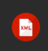

# LENGUAJE DE MARCAS UD1

## Definiciones lenguajes

### Definición


### Tipos de lenguajes:

| Tipo | Para que sireve | Ejemplo|
|------|-----------------|--------|
|Presentación|Muestra contenido| *HTML, CSS*|
| Descriptivo | Intercambio info | *XML, JSON* |
| Documentación | Documentar | *MD, Latex* |

## Instalaciones
1. VisualStudioCode
    1. Instalar [VS Code](https://code.visualstudio.com/download?_exp_download=fb315fc982)
2. Plugins instalados
   1. [HTML CSS Support](https://marketplace.visualstudio.com/items?itemName=ecmel.vscode-html-css)
   2. [Live Preview](https://marketplace.visualstudio.com/items?itemName=ms-vscode.live-server)
   3. [Markdow All in One](https://marketplace.visualstudio.com/items?itemName=yzhang.markdown-all-in-one)
   4. [XML](https://marketplace.visualstudio.com/items?itemName=redhat.vscode-xml)
   5. Adicionales 
        - [Error lens](https://marketplace.visualstudio.com/items?itemName=usernamehw.errorlens)
        - [Live Server](https://marketplace.visualstudio.com/items?itemName=ritwickdey.LiveServer)
        - [Indient-rainbow](https://marketplace.visualstudio.com/items?itemName=oderwat.indent-rainbow)
        - [Ghibli Icon Theme](https://marketplace.visualstudio.com/items?itemName=mchlln.vscode-ghibli-icon-theme)
3. Instalar git
```bash
sudo apt install git
```

|Plugins|Funcionalidad|Imagenes|
|-------|-------------|--------|
|**HTML CSS Support**|HTML id and class attribute completion for Visual Studio Code.||
|**Live Preview**|An extension that hosts a local server for you to preview your web projects on!||
|**Markdown All in One**|All you need for Markdown (keyboard shortcuts, table of contents, auto preview and more).||
|**XML**|This VS Code extension provides support for creating and editing XML documents, based on the LemMinX XML Language Server.||

